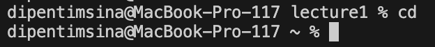
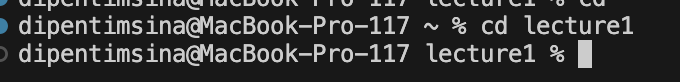
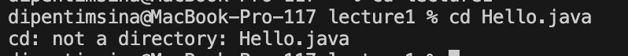
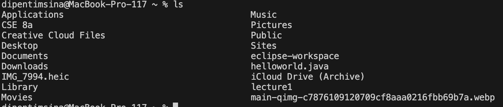
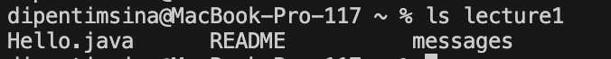
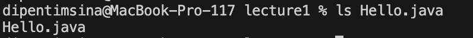
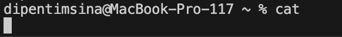
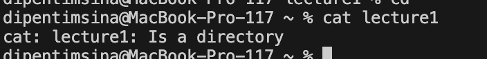
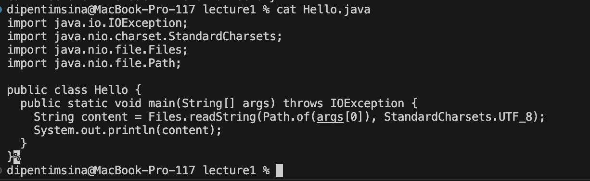

# Lab Report 1

## Dipen Timsina 
PID: A17388987

### 1. `cd` Commands
+ **Share an example of using the command with no arguments.**
1.  
2. Absolute Path= `/Users/dipentimsina/lecture1`
3. Explanation: If `cd` is executed without arguments,the user is returned to the home directory.
4. Output was not an error

+ **Share an example of using the command with a path to a directory as an argument.**
1.
2. Absolute path = `/Users/dipentimsina/lecture1`
3. Explanation: When using `cd` towards a path directory as an argument, in this case `lecture1`, it changes the current working directory to `lecture1`. In this case we were already at lecture one so thats why there wasn't a chnage in directory. 
4. Output was not an error

+ **Share an example of using the command with a path to a file as an argument.** 
1.
2. Absolute Path: `/Users/dipentimsina/lecture1`
3. Output is an error since cd expects a directory path, not a file path
4. Explanation: In this case we are using to `cd` command to a file (`Hello.java`) not a directory which is why we get an error message saying that `Hello.java` is not an directory

### 2. `ls` Commands 
+ **Share an example of using the command with no arguments.**
1. 
2. Absolute Path: `/Users/dipentimsina`
3. Output is not an error
4. Explanation: `ls` without arguments lists files and directories in the current directory, in this case its the files and directories of home.

+ **Share an example of using the command with a path to a directory as an argument.**
1. 
2. Absolute Path: `/Users/dipentimsina`
3. Output is not an error
4. Explanation: `ls` lists the contents of the specified directory, in this case it lists the contents of the `lecture1` file 

+ **Share an example of using the command with a path to a file as an argument.** 
1.
2. Absolute Path: `/Users/dipentimsina/lecture1 (home)`
3. Output is not an error
4. Explanation: `ls` on a file displays the file name if it exists, in this case `Hello.java` exists in `lecture1`, so it just prints Hello.java

    

### 3. `cat` Commands 
+ **Share an example of using the command with no arguments.**
1. 
2. Absolute Path: `/Users/dipentimsina`
3. Output is not an error
4. Explanation:Without arguments, `cat` waits for user input and displays it back, ending when Ctrl + D is pressed.

+ **Share an example of using the command with a path to a directory as an argument.**
1. 
2. Absolute Path: `/Users/dipentimsina`
3. Output is an error, since `lecture1` is a directory and `cat` can't display the content of a directory 
4. Explanation: `cat` cannot be used directly on a directory.

+ **Share an example of using the command with a path to a file as an argument.** 
1. 
2. Absolute Path: `/Users/dipentimsina/lecture1`
3. Output is not an error
4. The cat displays the content of the specified file, which in this case is the content of `Hello.java`.
