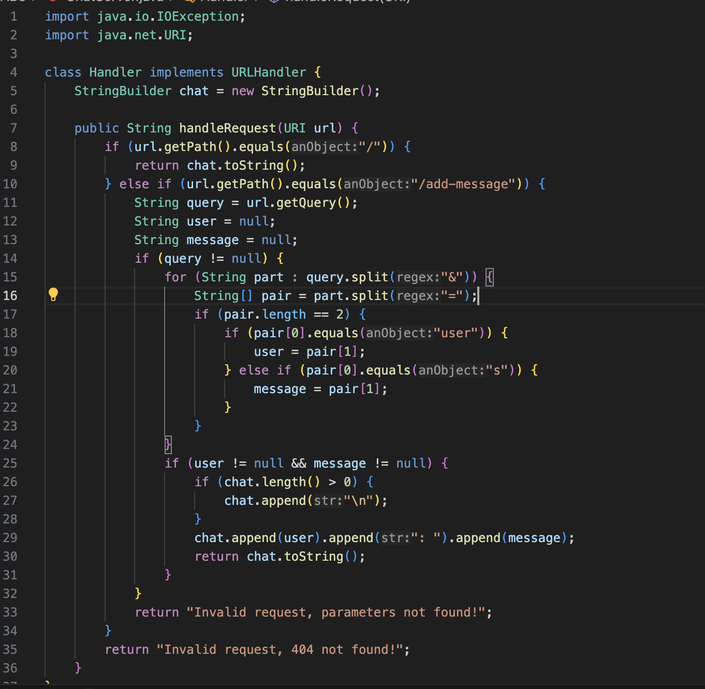
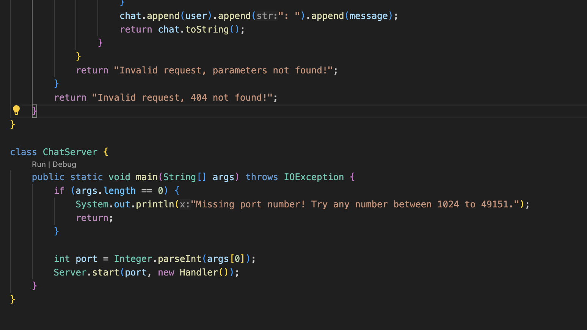
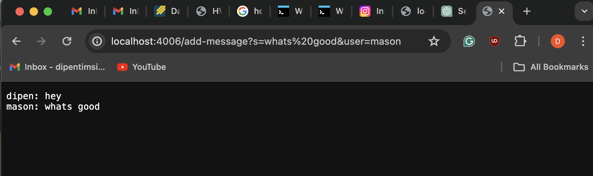
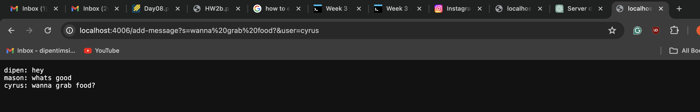
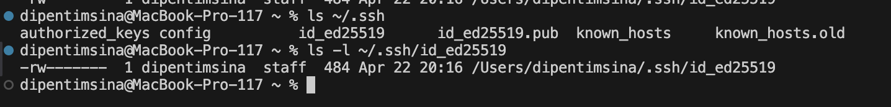
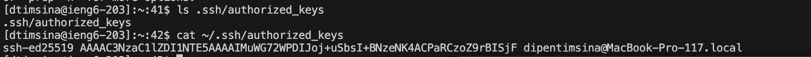
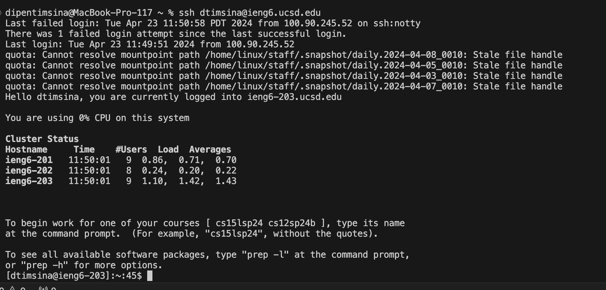

# Lab Report 2: Servers and SSH Keys

## Dipen Timsina 
PID: A17388987
## Part 1
### 1. Code
 
  
2A.  **First add method**
 
  Methods Called :
+ The handleRequest(URI url) method is the key function that's triggered when someone sends a request to your server. It looks at the URL to figure out what the user wants to do and then responds accordingly.

 Arguments & Values: 
+ URI url(argument): This parameter receives the URL that was accessed, helping determine what the user is trying to do on the server.
+ StringBuilder chat(field): This stores all chat messages and updates whenever a new message is added.

Value Change:
+ Starting with the initial chat content as "Dipen: Hey", when you send a new message with /add-message?s=What's%20good&user=Mason:

+ Processing the Request: The handleRequest method extracts user=Mason and message=What's good, formats them as "Mason: What's good", and appends it to the existing chat log with a newline.

+ chat Changes: The chat updates from "Dipen: Hey" to "Dipen: Hey\nMason: What's good".

 
 2B. **Second add method !**
 Method Called:
 + Just like last time, The handleRequest(URI url) method is called. It looks at the URL to figure out what the user wants to do and then responds accordingly. In this case adding words to the server. 

 Arguments & Values: 
 +  URI url(argument): Again This parameter receives the URL that was accessed(`http://localhost:4006/add-message?s=wanna%20grab%20food?&user=cyrus`), helping determine what the user is trying to do on the server.
+ StringBuilder chat(field): This stores all chat messages and updates whenever a new message is added. Previosluy it was Dipen and Mason with some greeting, not its going to add cyrus asking to grab food. 

Value Change: 
+ Processing the Request: When you send the request /add-message?s=wanna%20grab%20food&user=Cyrus, the handleRequest method identifies the parameters user=Cyrus and message=wanna grab food. It then formats this into "Cyrus: wanna grab food".
+ Updating chat Field: Given that chat currently has "Dipen: Hey\nMason: What's good", the new message is appended, resulting in "Dipen: Hey\nMason: What's good\nCyrus: wanna grab food".

## Part 2

1. `ls` with the absolute path to the private key for your SSH key for logging into ieng6.
 

2. `ls` with the absolute path to the public key for your SSH key for logging into ieng6 (this is the one you copied to your account on ieng6 using `ssh-copy-id`, so it should be a path on ieng6's file system).

3. No password

 

## Part 3

From the last two weeks I learned a lot about servers and how to run them/edit them to whatever you desire. It is still the basic of servers but this gives me an inisght of how companies may run their websites. I also learned how to adjust a browser into terminal using `curl`, which helped me a lot during the skill demo. From this lab I learned how to enter your ieng6 server without needing a password, along with creating your own local server. 

