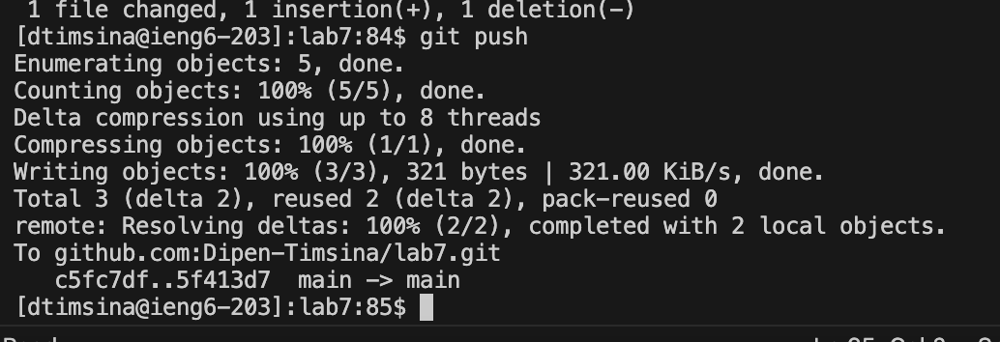

# Lab Report 4: VIM

## Dipen Timsina 
PID: A17388987

### Step 4
 

 + **Keys Pressed:** `<s><s><h><space><d><t><i><m><s><i><n><a><@><i><e><n><g><6><.><u><c><s><d><.><e><d><u><enter>`
 + This lets me log into the ieng6 server using my own account, in this case not needing a password

## Step 5
 
  + **Keys Pressed:** `<g><i><t><space><c><l><o><n><e><space><command><V><enter>`
  + I had the fork on my clipboard so I could just use ` command v ` instead of acutally having to type the entire ssh url. This command clones the repository onto the ieng6 server and creates a directory named lab7 in the process.

## Step 6

+ **Keys Pressed:** 
1. `<c><d><space><l><a><b><7><enter>`
2. `<b><a><s><h><space><t><e><s><t><.><s><h>`
+ The `cd` command is to change the directory to the `lab7` as that is where the tests are. 
+ Then we did the `bash` command with the filename, as that runs the test, and in this case it fails. 

## Step 7

 + **Keys Pressed:** 
`<v><i><m><space><shift L><i><s><t><shift E><x><a><m>
<l><e><s><.><j><a><v><a><enter>`

+ This command opens Vim to edit the code file called listExamples.java, the one that has the error. 

 + **Keys Pressed:** 
 `<control D><k><k><k><k><k><k><l><l><l><l><l><l><l><l><x><i><2><esc><:w><q><enter>`
+ I started with control d as that put me at the very last line of the code, I then pressed`k` multiple times(6) to go up to where the error was located. After I was at the right height I pressed `l` multiple times(8) to go to the right, and to the part where it said 1. Then I pressed `x` to remove the "1" in `index1` and pressed `i` then 2, to insert 2. I then pressed `esc` to go back to normal mode, then `:wq` to save and exit the file. 

## Step 8

+ **Keys Pressed:** 
 `<up><up><enter>`
 + Since I already had ran the `bash test.sh` command before, I could press up twice to retrieve it from the command line history. After I ran the command, it showed that the test now worked properly. 

## Step 9

+ **Keys Pressed:** 
 1. `<g><i><t><space><a><d><d><space><shift L><i><s><t><shift E><x><a><m>
<l><e><s><.><j><a><v><a><enter>`

 2. `<g><i><t><space><c><o><m><m><i><t><enter>`

 + The `git add ListExamples.java` stages the changes in `ListExamples.java` so they are ready to be committed. The `git commit` creates a new commit with the staged changes, saving them to the repository with a descriptive message.

 
 + **Keys Pressed:** 
 `<up><up><up><up><up><i><<M><a><d><e><space><t><h><e><space><c><h><a><n><g><e><space><o><f><space><s><w><i><t><c><h><i><n><g><space><i><n><d><e><x><1><space><t><o><space><i><n><d><e><x><2><:w><q>`

 + When I did `git commit`, it open up vim and told me to write about the changes I made. Then using the keys above, I added the message "Made the change of siwtching index1 to index2". Then I saved and quit out of vim using `:wq`.

 
+ **Keys Pressed:** 
 `<g><i><t><space>
<u><s><h><enter>`
 + `git push` uploaded the local commits the repository, updating it with your changes.

 

 

