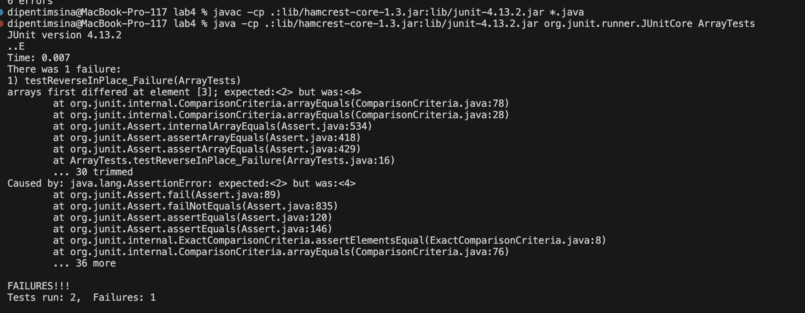
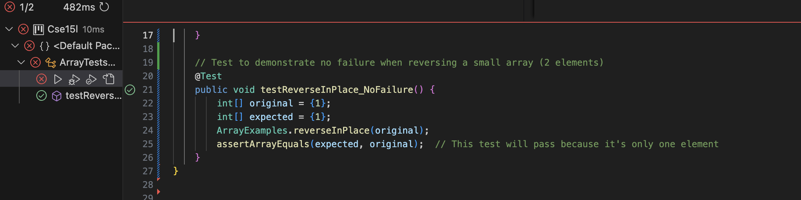
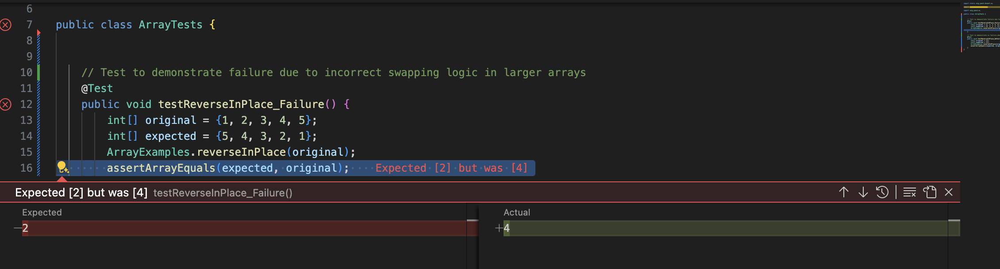
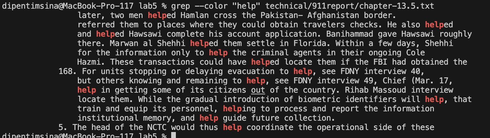

# Lab Report 3


## Dipen Timsina 
PID: A17388987

### Part 1. Bugs
(`ReverseinPlace`)

1.  A failure-inducing input for the buggy program, as a JUnit test and any associated code (write it as a code block in Markdown).
```java
public class ArrayExamplesTest {
    
    @Test
    public void testReverseInPlace_Failure() {
        int[] original = {1, 2, 3, 4, 5};
        int[] expected = {5, 4, 3, 2, 1};
        ArrayExamples.reverseInPlace(original);
        assertArrayEquals(expected, original);
    }
}
```


2. An input that doesn't induce a failure, as a JUnit test and any associated code (write it as a code block in Markdown). This works as there is only two numbers which the bug will not care about and not cause a failure. 

```java
import org.junit.Test;
import static org.junit.Assert.assertArrayEquals;

public class ArrayExamplesTest {
    
    @Test
    public void testReverseInPlace_NoFailure() {
        int[] original = {1, 2};
        int[] expected = {2, 1};
        ArrayExamples.reverseInPlace(original);
        assertArrayEquals(expected, original);
    }
}
```
3. The symptom, as the output of running the two tests above (provide it as a screenshot -- one test should pass, one test should fail).



4. The bug, as the before-and-after code change required to fix it (as two code blocks in Markdown).

Before
```
static void reverseInPlace(int[] arr) {
    for(int i = 0; i < arr.length; i += 1) {
        arr[i] = arr[arr.length - i - 1];
    }
}
```
After
```
static void reverseInPlace(int[] arr) {
    int temp;
    for (int i = 0; i < arr.length / 2; i++) {
        temp = arr[i];
        arr[i] = arr[arr.length - i - 1];
        arr[arr.length - i - 1] = temp;
    }
}
```


5. The corrected reverseInPlace method fixes the issue by swapping elements from the ends toward the middle using a temporary variable to safely hold values. This prevents overwriting and ensures each element is moved only once, avoiding any data corruption seen in the original method.


### Part 2. Researching Commands
1. grep -w
+ Example 1

` grep -w "help" technical/911report/chapter-13.5.txt `
```
 for the information only to help the criminal agents in their ongoing Cole
            168. For units stopping or delaying evacuation to help, see FDNY interview 40,
                but others knowing and remaining to help, see FDNY interview 49, Chief (Mar. 17,
                help in getting some of its citizens out of the country. Rihab Massoud interview
                locate them. While the gradual introduction of biometric identifiers will help, that
                institutional memory, and help guide future collection.
            5. The head of the NCTC would thus help coordinate the operational side of these
```
This will match occurrences of "the" but not "theme" or "other".
+ Example 2

` grep -w "be" technical/government/Alcohol_Problems/Session4-PDF.txt`

```
Treatment does not need to be sought actively to be effective.1
the emergency department have been shown empirically to be
participation in self-help groups. Brief interventions may be used
be needed to accomplish this goal. This paper describes the factors
screening blood alcohol level can be obtained easily when blood is
can easily be incorporated into a routine history and physical
dependence can be accomplished by asking several questions about
poor. More than 20% of patients who were thought to be intoxicated
that all patients at risk for alcohol problems should be screened
within this specialty will be slow and uneven.
be provided to emergency department personnel on a priority basis
that ED staff must be involved in conducting intervention trials in
journals likely to be encountered by emergency care providers.2,34
to obtain funding from alcohol study sections. Reviewers may not be
under-standing how treatment works, it may not be practical in the
intervention protocols, are not likely to be noticed or considered
interventions that are unlikely to be implemented.
in the emergency care setting should be geared more towards
attitude will be disseminated within the specialty by the work
to be successfully implemented. No other existing model is likely
to be useful in the real-world setting of the typical emergency
The opposite may be the case. Alcohol-related medical problems,
patients to accept a treatment referral or can be used to establish
department. Patients without insurance may also be referred to
at least some access to treatment services to which they can be
broad a change in service culture for this approach to be readily
approach that is most likely to be widely adopted.49
problem that can be tackled by a single discipline.
motivation.50 As a result, their services may be more effective
employees. It will be necessary to provide evidence that hiring
There is reason to believe that cost-effectiveness can be
absenteeism, and unemployment. Study outcomes should be
databases should be used to assess other
The model law states, "The insurer shall not be liable for any
is not performed, the provision cannot be applied. Physicians are
(1) "This provision may not be used with respect to a medical
be stigmatized. The laws are contained in the Code of Federal
to be
can be shared with others.54 A special "Consent for the Release of
Confidential Information" form must be signed in order for this
information to be released.55 Under federal regulations, a general
patterns, studies on alcohol interventions should be framed,
3. Research support should be primarily for services research,
patients in need of more extensive services. Studies should be
and interventions for alcohol-related problems must be integrated
single questions needs to be developed that can identify at-risk
Health care settings should be considered safe, effective,
Medicine report1 should be applied to all patients with
needed. A set of single policy-relevant questions should be
problem. Addressing emergency medicine training will be very
The emergency department-based research agenda need not be
limited to the biomedical model. It should be extended to include
can be effective in decreasing morbidity and mortality. This is
certainly an area where we can be proactive in highlighting the
Other areas also need to be addressed, and some definitions need
to be clarified. For example, Dr. Gentilello performed a MEDLINE
states that the studies need to be framed, focused, and performed
area, but the contribution of other researchers should not be
negated, nor should other researchers be discouraged from working
in this area. What is important is that a team approach be taken to
intervention should not be eliminated. Translational studies will
would be of tremendous benefit to the field of emergency medicine.
coverage. Other policy questions need to be answered as well. Would
facilities? What degree of confidentiality can be assured with
need to be clear about the disease processes that we are interested
"injury" is more inclusive and should be used, as "trauma" is a
can be implemented and evaluated. In addition, we often have
area, but there are many other policy directions that must be
evaluated. These policies may be public or private and may be
presenting to the ED be screened. Given this reaction by
Connecticut, require that anyone who is incapacitated by alcohol be
trauma centers be able to perform blood alcohol testing was
eliminated.4 The message this sends may be interpreted in several
purview of the trauma team; c) nothing can be done to address the
there is an ED alcohol research center, will there also be a
may not be problematic in an institution with an indirect rate of
Although funding strategies can be improved, funding is available
economists should be part of the research team. He noted that we
to be standardized so that they know why a treatment is working.
must be standardized in order to assess its cost-effectiveness.
Linda Degutis added that interventions have to be monitored. If
research must be published not in substance abuse journals, but in
alcohol test in patients with head injuries can be trouble-some.
patient and the setting, paths can be traveled very quickly and
NIH can be difficult, the experience of re-submitting grants has
strengthened his work. The process can be a learning opportunity
EDs in the country, it will be necessary for an external body like
JCAHO to be thinking about this now. In the meantime, we need to be
to focus on what can be accomplished specifically in the ED
clinical settings. Results from such studies will be used.
adaptation. Would they be patient outcomes or process measures?
drinking would probably be appropriate. Surgeons would probably be
be a suitable outcome for emergency physicians.
screening instrument in the ED. It could be the first step toward
be as important an outcome to ED staff as decreased re-visits to
be a useful source of follow-up data, as can a simple phone call to
medical journals. She wondered if articles by non-MDs would be
would, medical journals might need to be educated to accept
values. He related that his alcohol studies used to be returned
Hargarten observed that the impediments to publishing seem to be
areas need to be included in other appropriate journals.
research activities need to be carried out in all three elements of
```
Finds all the occurances of "be" as a whole world so belive would not be found or bees or bee/


2. grep -i

+ Example 1

`grep -i "while" technical/911report/chapter-10.txt`
```
After the attacks had occurred, while crisis managers were still sorting out a number
            While the plan at the elementary school had been to return to Washington, by the time
                President's remarks, while the lead Secret Service agent reviewed the security
                they encountered while following up leads in the FBI's investigation of the 9/11
                continue to act against the United States even while under Taliban control. It
                Clarke recalls the President telling them." See if he's linked in any way." While he believed the details of Clarke's account to be
```

The grep -i option in the grep command makes the search case-insensitive. When you use this option, grep will match the search pattern regardless of the case (uppercase or lowercase) of the text in the files. In this case while is searched for.

+ Example 2

`grep -i "research" technical/government/Alcohol_Problems/DraftRecom-PDF.txt`

```
outlining the group's ultimate task-to create research
Recommendation #1 Research on screening and intervention should
point of the first recommendation was that research efforts should
research recommendations with a recommendation that included
research on screening has involved an evaluation of screening, but
problematic. Enough research has been conducted on instruments
alone, he said, and new research should link screens with
document would include government officials, researchers,
him, it was saying that work should not include screening research
screening for certain sub-populations, so screening research still
has its place. Although he agreed that a total research portfolio
Referral-SBIR." Research on the individual components is important,
Hungerford emphasized that research on screening is needed.
However, he believed research on screening instruments that is not
Hungerford proposed that just as screening research should be
the screen can have an interventive effect, so he wanted research
there are research methodologies that are related to evaluating
Thomas Babor supported technical research on screening and the
obstacles to screening, and practical research on screening
screening were not as fruitful topics for research as how to screen
research emphasizing the performance characteristics and
research on operational and practical characteristics.
it is already used to designate small business innovation research
critical consideration in moving a new practice from a research
issue of financing and suggested the following phrase, "Research
Pollock asked Gordon whether research on alcohol interventions
departments, underscoring the importance of research in that
Recommendation #4 Research is needed to evaluate the effects of
affect research studies.
research should develop ways to mitigate legal, privacy, and
Recommendation #5 Research is needed on how demographic and
how researchers and clinicians tailor interventions to apply to
Recommendation #6 Research is needed to identify the factors
Walker urged that this research not be confined to academic
Robert Lowe suggested a range of research topics could come
"Research in this category may address a broad range of
factors affecting that relationship. This research is crucial as
the field progresses from evaluating efficacy in research settings
"implementation" to the recommendation. Research is needed on how
relate to Level I trauma care research. Therefore, he supported
including community hospitals in research efforts. He thought the
thought that encouraging this linkage in research proposals could
reduce the lag time between academic research showing the
likely to happen in the ED. He called for research on barriers
policy-relevant research to institutionalize and to promote
organizational changes. He suggested that research on ways of
Recommendation #7 Research is needed to explore and define the
Recommendation #8 Funding agencies should support research on
and make the mechanisms of research supportknown to potential
Longabaugh wanted the recommendation to include research
post-doctoral program in intervention and treatment research.
However, the program has produced a great deal of research.
Mechanisms to facilitate the training of good researchers,
types of research. SAMHSA funds applied research, and their
research in this area. However, funding agencies cannot be forced
to make research on alcohol problems in the ED a high priority.
careful consideration. We can also recommend that research efforts
attempt to broaden the focus of current research activities to
Longabaugh commented that an NIAAA effort to conduct research on
promote ED-based research by emphasizing the large number of ED
Mary Dufour described how NIAAA sets research priorities. To
with a subcommittee that helps to set research priorities.
research priorities, she said. Every three to five years, NIAAA
reviews its whole research portfolio; it identifies gaps, which
become research priorities. Alcohol and injury, as well as brief
thought combining alcohol and drug research in EDs could lead to
more research dollars. He noted a growing understanding of the
appeal to NIDA, he said, the referral aspect of the research should
demand for research in EDs from outside an agency would also be
Research on alcohol problems is as important as research on sepsis
alcohol-related research in the surgery section. It was all in the
might enhance the rationale for more research.
```
The grep -i option in the grep command makes the search case-insensitive. When you use this option, grep will match the search pattern regardless of the case (uppercase or lowercase) of the text in the files. In this case we are searching for research, so Research RESEARCH, REsearch would all work. 


3. grep -v
+ Example 1
` grep -vE "the|we|We" technical/911report/preface.txt`

```
 PREFACE
                Democrats chosen by elected leaders from our nation's capital at a time of great
                avoid such tragedy again?
                27, 2002).
                to intelligence agencies, law enforcement agencies, diplomacy, immigration issues
                current and previous administrations who had responsibility for topics covered in
                public testimony from 160 witnesses.
                learned.
                political grievances, but its hostility toward us and our values is limitless. Its
                targets. Collateral damage is not in its lexicon.
                and national security did not understand how grave this threat could be, and did not
                sharing information across a large and unwieldy government that had been built in a
                different era to confront different dangers.
                accountability.
                built. They have given good advice, and faithfully carried out our guidance. They
                every knowledgeable person or found every relevant piece of paper. New information
                this process with strong opinions about what would work. All of us have had to
                citizens to study, reflect-and act.
            Thomas H. Kean, chair
            Lee H. Hamilton, vice chair
```
In this case we are getting back all the lines that dont contain we, We, or the in the Preface.txt
That is what `grep -v` does as it returns the lines not containing the specified ones 

+ Example 2

` grep -v "PREFACE" technical/911report/preface.txt`

```

            We present the narrative of this report and the recommendations that flow from it to
                the President of the United States, the United States Congress, and the American
                people for their consideration. Ten Commissioners-five Republicans and five
                Democrats chosen by elected leaders from our nation's capital at a time of great
                partisan division-have come together to present this report without dissent.
            We have come together with a unity of purpose because our nation demands it.
                September 11, 2001, was a day of unprecedented shock and suffering in the history of
                the United States. The nation was unprepared. How did this happen, and how can we
                avoid such tragedy again?
            To answer these questions, the Congress and the President created the National
                Commission on Terrorist Attacks Upon the United States (Public Law 107-306, November
                27, 2002).
            Our mandate was sweeping. The law directed us to investigate "facts and circumstances
                relating to the terrorist attacks of September 11, 2001," including those relating
                to intelligence agencies, law enforcement agencies, diplomacy, immigration issues
                and border control, the flow of assets to terrorist organizations, commercial
                aviation, the role of congressional oversight and resource allocation, and other
                areas determined relevant by the Commission. In pursuing our mandate, we have
                reviewed more than 2.5 million pages of documents and interviewed more than 1,200
                individuals in ten countries. This included nearly every senior official from the
                current and previous administrations who had responsibility for topics covered in
                our mandate. We have sought to be independent, impartial, thorough, and nonpartisan.
                From the outset, we have been committed to share as much of our investigation as we
                can with the American people. To that end, we held 19 days of hearings and took
                public testimony from 160 witnesses.
            Our aim has not been to assign individual blame. Our aim has been to provide the
                fullest possible account of the events surrounding 9/11 and to identify lessons
                learned.
            We learned about an enemy who is sophisticated, patient, disciplined, and lethal. The
                enemy rallies broad support in the Arab and Muslim world by demanding redress of
                political grievances, but its hostility toward us and our values is limitless. Its
                purpose is to rid the world of religious and political pluralism, the plebiscite,
                and equal rights for women. It makes no distinction between military and civilian
                targets. Collateral damage is not in its lexicon.
            We learned that the institutions charged with protecting our borders, civil aviation,
                and national security did not understand how grave this threat could be, and did not
                adjust their policies, plans, and practices to deter or defeat it. We learned of
                fault lines within our government-between foreign and domestic intelligence, and
                between and within agencies. We learned of the pervasive problems of managing and
                sharing information across a large and unwieldy government that had been built in a
                different era to confront different dangers.
            At the outset of our work, we said we were looking backward in order to look forward.
                We hope that the terrible losses chronicled in this report can create something
                positive-an America that is safer, stronger, and wiser. That September day, we came
                together as a nation. The test before us is to sustain that unity of purpose and
                meet the challenges now confronting us. We need to design a balanced strategy for
                the long haul, to attack terrorists and prevent their ranks from swelling while at
                the same time protecting our country against future attacks. We have been forced to
                think about the way our government is organized. The massive departments and
                agencies that prevailed in the great struggles of the twentieth century must work
                together in new ways, so that all the instruments of national power can be combined.
                Congress needs dramatic change as well to strengthen oversight and focus
                accountability.
            As we complete our final report, we want to begin by thanking our fellow
                Commissioners, whose dedication to this task has been profound. We have reasoned
                together over every page, and the report has benefited from this remarkable
                dialogue. We want to express our considerable respect for the intellect and judgment
                of our colleagues, as well as our great affection for them.
            We want to thank the Commission staff. The dedicated professional staff, headed by
                Philip Zelikow, has contributed innumerable hours to the completion of this report,
                setting aside other important endeavors to take on this all-consuming assignment.
                They have conducted the exacting investigative work upon which the Commission has
                built. They have given good advice, and faithfully carried out our guidance. They
                have been superb. We thank the Congress and the President. Executive branch agencies
                have searched records and produced a multitude of documents for us. We thank
                officials, past and present, who were generous with their time and provided us with
                insight. The PENTTBOM team at the FBI, the Director's Review Group at the CIA, and
                Inspectors General at the Department of Justice and the CIA provided great
                assistance. We owe a huge debt to their investigative labors, painstaking attention
                to detail, and readiness to share what they have learned. We have built on the work
                of several previous Commissions, and we thank the Congressional Joint Inquiry, whose
                fine work helped us get started. We thank the City of New York for assistance with
                documents and witnesses, and the Government Printing Office and W.W. Norton
                & Company for helping to get this report to the broad public.
            We conclude this list of thanks by coming full circle: We thank the families of 9/11,
                whose persistence and dedication helped create the Commission. They have been with
                us each step of the way, as partners and witnesses. They know better than any of us
                the importance of the work we have undertaken.
            We want to note what we have done, and not done. We have endeavored to provide the
                most complete account we can of the events of September 11, what happened and why.
                This final report is only a summary of what we have done, citing only a fraction of
                the sources we have consulted. But in an event of this scale, touching so many
                issues and organizations, we are conscious of our limits. We have not interviewed
                every knowledgeable person or found every relevant piece of paper. New information
                inevitably will come to light. We present this report as a foundation for a better
                understanding of a landmark in the history of our nation.
            We have listened to scores of overwhelming personal tragedies and astounding acts of
                heroism and bravery. We have examined the staggering impact of the events of 9/11 on
                the American people and their amazing resilience and courage as they fought back. We
                have admired their determination to do their best to prevent another tragedy while
                preparing to respond if it becomes necessary. We emerge from this investigation with
                enormous sympathy for the victims and their loved ones, and with enhanced respect
                for the American people. We recognize the formidable challenges that lie ahead.
            We also approach the task of recommendations with humility. We have made a limited
                number of them. We decided consciously to focus on recommendations we believe to be
                most important, whose implementation can make the greatest difference. We came into
                this process with strong opinions about what would work. All of us have had to
                pause, reflect, and sometimes change our minds as we studied these problems and
                considered the views of others. We hope our report will encourage our fellow
                citizens to study, reflect-and act.
            Thomas H. Kean, chair
            Lee H. Hamilton, vice chair
```

In this case we are returning back all the lines that do not contain PREFACE which is every line except for the title. 


4.   grep --color
+ Example 1


The grep --color option highlights matching text in the terminal to improve readability, using --color=auto to display color when output is to the terminal. In the picture we can see the improvement in readability of Prefeace

+ Example 2

The grep --color option highlights matching text in the terminal to improve readability, using --color=auto to display color when output is to the terminal. In the picture we can see the improvement in readability of Help in all the cases where help might be found. 

#### Works Cited
1. https://www.geeksforgeeks.org/grep-command-in-unixlinux/
2. https://linuxcommando.blogspot.com/2007/10/grep-with-color-output.html


